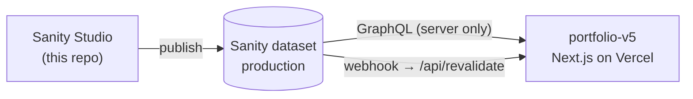

# portfolio-api

Sanity Studio and content schema for [pratham82.in](https://www.pratham82.in). The site ([portfolio-v5](https://github.com/Pratham82/portfolio-v5)) reads this content on the server through Sanity's GraphQL API.

- GraphQL: `https://sfjfod25.api.sanity.io/v2025-09-19/graphql/production/default`
- Project `sfjfod25`, dataset `production`

## How it connects to the site



Publishing in Studio fires a webhook to the site's `/api/revalidate`, which expires its Sanity cache, so changes are live on the next visit without a deploy. The webhook is configured in sanity.io/manage → API → Webhooks; see the site's [architecture doc](https://github.com/Pratham82/portfolio-v5/blob/master/docs/architecture.md#publishing-from-sanity).

## Content

The desk (`structure.ts`) shows:

| Studio item | Type                                                                  | Used on the site for                                                                                                                                               |
| ----------- | --------------------------------------------------------------------- | ------------------------------------------------------------------------------------------------------------------------------------------------------------------ |
| Home Page   | `homePage` (singleton)                                                | The hero: title and intro (`subtitle`, HTML; keep the location on its last line)                                                                                   |
| Experience  | `workExperiencePage` (singleton)                                      | Company logos, and `resume.resumeLink`: the site reads roles and bullets from that resume PDF                                                                      |
| Now         | `nowPage` (singleton)                                                 | `/now`: `updated`, `body` (markdown, rendered as MDX) and `favouriteFilms` (up to 4 `favouriteFilm`s: title, release year, Letterboxd URL; posters come from TMDB) |
| Links       | `link`                                                                | `/links` and `/links/<slug>`: title, slug, description, categories, URL, date, markdown body                                                                       |
| Projects    | `project`                                                             | `/projects`                                                                                                                                                        |
| Authors     | `author`                                                              | Blog post bylines                                                                                                                                                  |
| Legacy      | `aboutPage`, `post`, `blogsPage`, `category`, `contactsPage`, `photo` | Not read by the site; kept until the blog migration is planned                                                                                                     |

Singletons have fixed document IDs (the type name), can't be created from the "new document" menu, and can't be duplicated or deleted.

## Setup

```bash
npm install
# .env
SANITY_STUDIO_PROJECT_ID=sfjfod25
SANITY_STUDIO_DATASET=production
npm run dev   # Studio at http://localhost:3333
```

## Scripts

| Command                                 | Purpose                                                                                                                                                            |
| --------------------------------------- | ------------------------------------------------------------------------------------------------------------------------------------------------------------------ |
| `npm run dev`                           | Studio locally                                                                                                                                                     |
| `npm run deploy`                        | Deploy the hosted Studio                                                                                                                                           |
| `npm run deploy-graphql`                | Deploy the GraphQL API                                                                                                                                             |
| `npm run typecheck` / `npm run lint`    | `tsc --noEmit` / ESLint                                                                                                                                            |
| `npm run migrate [-- --dry-run]`        | One-off Sanity 6 data migration (singleton IDs, resume link, tech stack typo). Safe to re-run                                                                      |
| `npm run import-content [-- --dry-run]` | One-off import of the site's old Now and Links MDX files. Already run; the source files have since been removed from portfolio-v5, so it's kept for reference only |

## Changing a schema

1. Edit `schemas/` (register new types in `schemas/index.ts`). Object types used inside arrays need a name (`defineType`), or GraphQL can't type them.
2. `npx sanity graphql deploy --dry-run` to check for breaking changes, then `npm run deploy-graphql`. **The site queries GraphQL, so a new field doesn't exist for it until this runs**, and its build fails if it asks for one that doesn't.
3. `npm run deploy` so the hosted Studio shows the change.
4. Update the site's `.graphql` queries in `portfolio-v5/src/graphql/queries/`.
